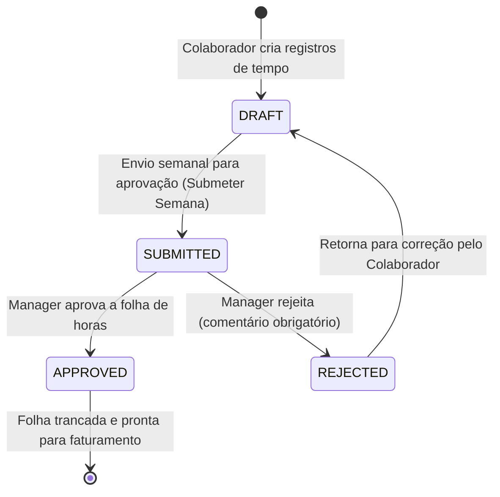

# 👤 Regras de Negócio e Funcionalidades

Este documento apresenta as funcionalidades do **OptSolv Time Tracker** sob a ótica do usuário e do negócio, explicando como os fluxos agregam valor operacional e as regras que regem a plataforma.

---

## 👥 Personas e Perfis de Acesso

O sistema possui controle de acesso baseado em papéis (RBAC - Role-Based Access Control) que divide os usuários em três perfis principais:

| Perfil | Quem é | Principais Atividades | Meta na Plataforma |
| :--- | :--- | :--- | :--- |
| **Colaborador (Member)** | Desenvolvedores, designers e especialistas que atuam diretamente em projetos. | • Iniciar/pausar timer ativo • Vincular horas a Work Items do Azure DevOps • Lançar horas retroativas • Submeter timesheet semanal | Registrar horas de forma precisa em menos de 2 minutos por dia. |
| **Gerente (Manager)** | Tech Leads, Project Managers e coordenadores de squads. | • Analisar dashboard de horas do time • Aprovar ou rejeitar timesheets de membros da squad • Monitorar budget de horas dos projetos ativos | Garantir conformidade nos lançamentos e controlar prazos de entrega. |
| **Administrador (Admin)** | Equipe de operações internas e gerência executiva. | • CRUD de projetos e alocação de pessoas • Convidar usuários e redefinir perfis • Ajustar taxas horárias corporativas • Exportar relatórios consolidados de custos | Auditar todo o ecossistema e extrair relatórios consolidados para fechamentos. |

---

## 🔄 O Ciclo de Vida do Timesheet

A consistência e conformidade de pagamentos e auditorias apoiam-se em um fluxo estruturado de controle de horas agrupado por semana. Uma folha de horas (Timesheet) transiciona entre quatro estados principais:

### Regras Críticas do Ciclo de Vida:
1.  **Bloqueio de Edição:** Uma vez que um Timesheet entra no estado **SUBMITTED** ou **APPROVED**, as entradas de tempo vinculadas a ele são travadas contra edições ou exclusões para assegurar a integridade dos dados auditados.
2.  **Validação de Envio:** O sistema exibe um alerta preventivo se o colaborador tentar submeter uma semana contendo menos de 6 horas por dia útil (totalizando menos de 30h/semana), embora não impeça o envio caso haja justificativa legítima (como férias ou folgas).
3.  **Fluxo de Correção:** Em caso de rejeição por parte do gestor, a folha inteira retorna ao estado de **DRAFT**. O colaborador visualiza o comentário do gestor em destaque no dashboard, podendo corrigir os apontamentos incorretos e submetê-la novamente.

---

## 🎯 Módulos e Funcionalidades Principais

### 1. Registro de Tempo Inteligente
*   **Timer em Tempo Real:** Localizado no shell principal do app (sidebar), o cronômetro Start/Stop acompanha o usuário em qualquer página da aplicação. O timer é persistido no banco de dados, o que significa que o tempo não é perdido caso a página seja recarregada ou o navegador fechado.
*   **Conversão de Formatos:** O input de horas manuais aceita escrita natural de tempo. Exemplos:
    *   `"2.5"` ou `"2,5"` viram `02:30h`
    *   `"2h30"` ou `"2h 30m"` viram `02:30h`
    *   `"150m"` vira `02:30h`
*   **Sugestões Inteligentes (Time Copilot):** Um motor inteligente que lê os commits mais recentes do Git (do dia) e as reuniões do calendário corporativo (Outlook) para montar uma proposta de timesheet preenchida no final do dia.

### 2. Visão de Calendário e Heatmap
*   **Mapa de Calor:** Visualização mensal inspirada no GitHub, utilizando cores de intensidade baseadas nas horas registradas. Dias com horas normais (≥8h) ficam verdes ou laranjas escuros; dias parciais (4h-7h) ficam amarelos; e dias vazios ou insuficientes ficam cinzas ou vermelhos.
*   **Painel Deslizante:** Clicar em qualquer dia do calendário abre uma aba deslizante lateral (Drawer/Sheet) contendo o detalhe das entradas e permitindo lançar novos blocos rapidamente por um formulário compacto.

### 3. Cockpit de Relatórios & Analytics
*   **Visão Individual:** Gráficos interativos (Recharts) que mostram a distribuição do tempo faturável (billable) vs. não faturável (non-billable), agrupados por projeto ao longo do período selecionado.
*   **Visão de Equipe (Cockpit Gerencial):** Fornece aos gerentes o status de faturamento global, alertas de sobrecarga de desenvolvedores (risco de burnout) ou desvio de estimativas.

### 4. Exportação Premium
*   **Excel (.xlsx):** Gera arquivos Excel multilíngues e com formatação sofisticada (Headers da marca, fontes limpas, autoajuste de colunas). O relatório inclui uma aba de **Resumo Executivo** para envio direto a clientes, uma aba de **Detalhamento de Linhas** e breakdowns por colaborador.
*   **PDF:** Relatório estético gerado client-side com layouts adaptados para impressão física ou digital (ideal para relatórios mensais de prestação de serviços).

---

[⬅️ Voltar para a Página Inicial](Home.md)
